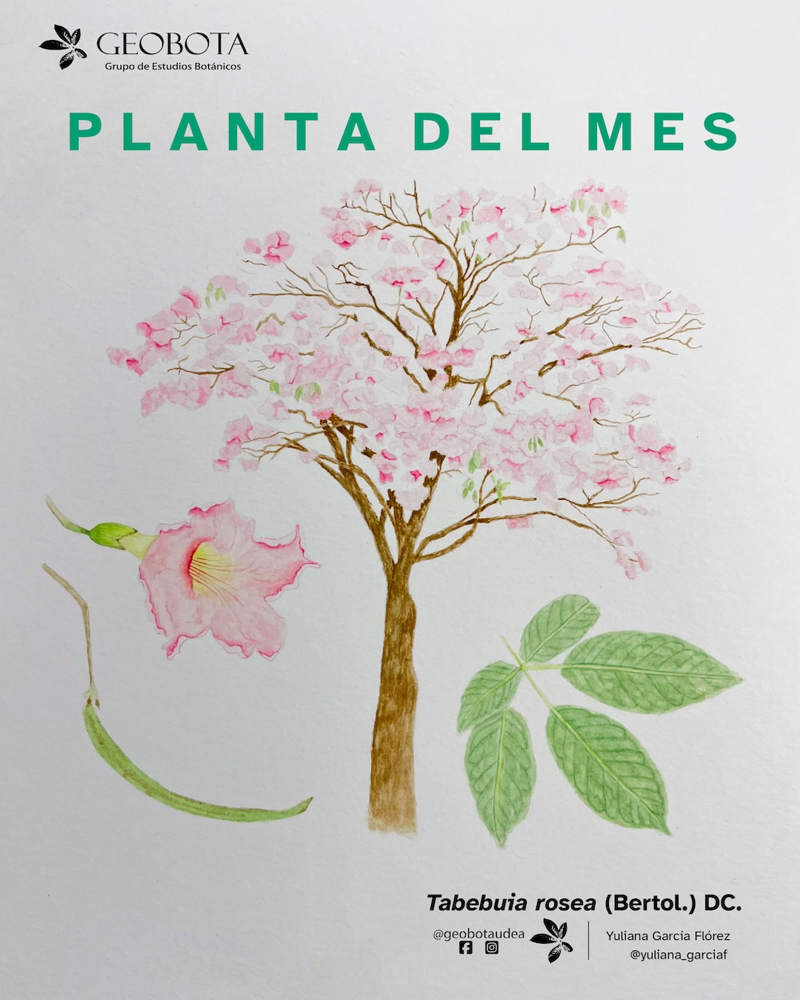

<meta name="fediverse:creator" content="@alexespinosaco@mstdn.social">

Antes de finalizar marzo y dar paso al receso de Semana Santa, te invitamos a
disfrutar de una nueva entrega de nuestra sección **La planta del mes**, esta vez
dedicada a un árbol inspirador e inigualable por su profusa y llamativa
floración. En esta ocasión contamos con la colaboración de una hermosa
ilustración a color realizada por [Yuliana García
Flórez](https://www.instagram.com/yuliana_garciaf/).

{fig-align="center" group="my-gallery"
fig-alt="Ilustración botánica a color de Aiphanes horrida (Jacq.) Burret, mostrando diferentes vistas de la planta. En el centro de la imagen se incluye el hábito. En la derecha un detalle de una hoja. En la izquierda una infrutescencia y un fruto partido. En la esquina superior izquierda aparece el logo del Grupo de Estudios Botánicos GEOBOTA. En la esquina superior derecha dice «Planta del mes». En la parte inferior, se encuentran los créditos de la ilustración @adrianasaninilustradora y @geobotaudea."}

## Un árbol emblemático de los trópicos americanos

***Tabebuia rosea*** **(Bertol.) DC.**, conocida comúnmente como **guayacán
rosado**, roble, roble morado, chicalá, apamate o flor morado, es una especie de
la familia **Bignoniaceae** que se distribuye naturalmente desde México hasta el
norte de Suramérica, incluyendo Colombia. Habita desde el nivel del mar hasta
aproximadamente los 2100 m s. n. m., en bosques húmedos y bosques premontanos.

Debido a su espectacular floración, esta especie es ampliamente cultivada como
ornamental en parques, jardines y calles de ciudades y poblaciones de climas
cálidos y templados. Actualmente, se encuentra cultivada en más de 70 jardines
botánicos alrededor del mundo.

## Floración, forma y reproducción

Este árbol puede alcanzar entre **15 y 30 metros de altura** y presenta una copa
amplia y extendida. Su floración es densa y abundante: las flores, de forma
acampanada y textura ligeramente carnosa, varían entre tonos rosados, violeta
claro e incluso blanco-rosado. Estas suelen aparecer durante la época seca,
cuando el árbol pierde parcial o totalmente su follaje, creando paisajes urbanos
y naturales de gran impacto visual.

Sus frutos son cápsulas alargadas que, al madurar, se abren para liberar
**semillas aladas** dispersadas por el viento, generalmente antes del inicio de
la temporada de lluvias.

## Usos tradicionales y valor económico

Además de su valor ornamental, el guayacán rosado ha sido utilizado
tradicionalmente en sistemas agroforestales, donde provee **sombra para cultivos
como café y cacao**. Su madera, ligera y de fácil manejo, se emplea en la
fabricación de muebles, pisos, enchapes decorativos, puertas y utensilios de
cocina; en algunas regiones también se utiliza para la producción de carbón.

::: callout-tip
¿Sabías que *Tabebuia rosea* es el árbol nacional de El Salvador?
:::

En la medicina tradicional, distintas partes del árbol han sido empleadas para
tratar diversas afecciones. La corteza se ha usado en preparados para la
diabetes, el paludismo, la fiebre tifoidea y los parásitos intestinales; también
se le atribuyen usos contra la anemia, el estreñimiento, inflamaciones
estomacales y el reumatismo. Las flores y hojas se consumen en infusión como
febrífugo o para aliviar la amigdalitis, y las hojas calentadas se aplican
externamente para tratar fiebre o catarro.

Sin embargo, es importante señalar que **estos usos no cuentan con suficiente
respaldo científico**, y el consumo de preparados puede generar efectos
adversos. La planta contiene compuestos como el **lapachol**, estudiado por su
posible actividad anticancerígena, pero que también presenta efectos secundarios
potencialmente tóxicos.

## Importancia ecológica y manejo en el paisaje

Desde el punto de vista ecológico, ***Tabebuia rosea*** es una especie valiosa
en programas de reforestación, restauración ecológica y recuperación de suelos,
debido a su rápido crecimiento y capacidad de adaptación. Sus flores, ricas en
néctar, atraen una amplia diversidad de polinizadores, incluyendo **colibríes,
abejas, abejorros y mariposas**.

No obstante, fuera de su área de distribución natural puede comportarse como
especie invasora, compitiendo con la vegetación local. Además, en entornos
urbanos no se recomienda su siembra en aceras estrechas o espacios reducidos, ya
que sus raíces vigorosas y la fragilidad relativa de sus ramas pueden generar
riesgos para la infraestructura y las personas.

## Estado de conservación

A nivel global, la especie se clasifica com **Preocupación Menor (LC)** según la
Lista Roja de la UICN. Sin embargo, en Colombia algunas poblaciones naturales
han sufrido explotación excesiva, especialmente en la región Caribe, debido al
uso maderero y la producción de carbón. Como resultado, su aprovechamiento se
encuentra regulado en departamentos como Sucre por las autoridades ambientales
regionales.

Ilustración: [Yuliana García
Flórez](https://www.instagram.com/yuliana_garciaf/).
