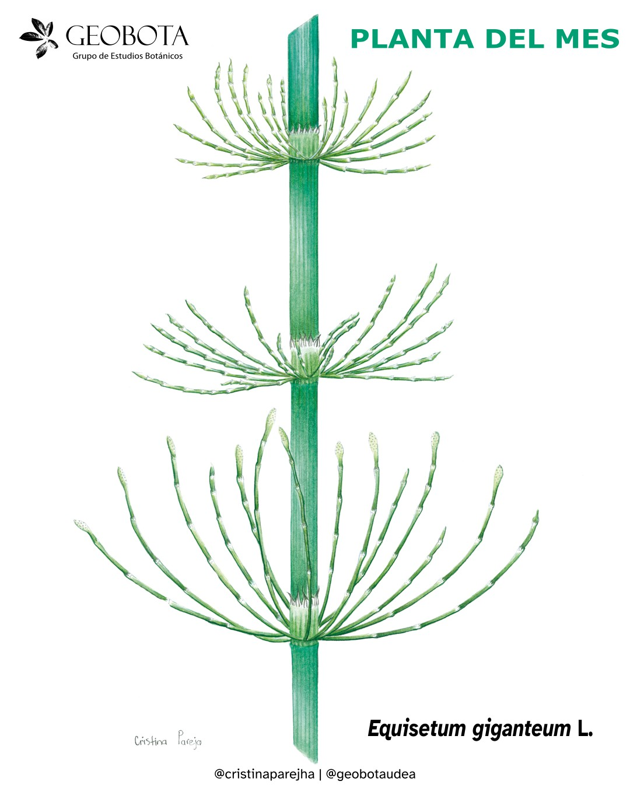

<meta name="fediverse:creator" content="@alexespinosaco@mstdn.social">

Para el mes de abril seleccionamos una planta de nombre y forma de crecimiento
muy particular: **la cola de caballo**, *Equisetum giganteum* L. Se trata de una
hierba terrestre perteneciente a la familia **Equisetaceae**, nativa de los
bosques neotropicales desde México hasta Argentina, incluyendo las Antillas.

En Colombia, esta especie se encuentra principalmente en áreas abiertas y suelos
húmedos o anegados, en ecosistemas de bosques húmedos entre los **600 y 3000 m
s. n. m.** Ha sido reportada en regiones como la Amazonia, los Andes, la llanura
del Caribe y la Sierra Nevada de Santa Marta, con registros en departamentos
como Antioquia, Boyacá, Cesar, Chocó, Cundinamarca, Guainía, Huila, Nariño,
Putumayo, Quindío, Tolima y Valle del Cauca.

{fig-align="center" group="my-gallery"
fig-alt="Ilustración botánica a color de Equisetum giganteum L. mostrando su tallo y ramas. En la esquina superior izquierda aparece el logo del Grupo de Estudios Botánicos GEOBOTA. Debajo aparece: «Planta del mes». En la parte inferior, se encuentran los créditos de la ilustración y las redes sociales de GEOBOTA, @geobotaudea y Cristina Pareja @cristinaparejha."}

## Un linaje milenario

Las colas de caballo pertenecen a uno de los linajes de plantas más antiguos del
planeta, con registros fósiles que se remontan a aproximadamente **370 millones
de años**. Su nombre común hace referencia a su morfología: presentan tallos
verdes, huecos y articulados que pueden alcanzar hasta **5 metros de altura**,
con ramas laterales cortas y péndulas que emergen de los nudos.

Sus hojas son diminutas y están reducidas a escamas triangulares. Al igual que
los helechos, estas plantas no producen flores ni semillas, sino que se
reproducen por **esporas**, las cuales se generan en estructuras terminales
denominadas **estróbilos**.

## Usos medicinales y tradicionales

*Equisetum giganteum* es ampliamente reconocida por sus usos medicinales. Es
frecuente encontrarla como ingrediente en productos para el cuidado capilar,
debido a su asociación con el fortalecimiento del cabello.

Tradicionalmente, se le atribuyen propiedades **antiinflamatorias,
cicatrizantes, diuréticas, antisépticas, hemostáticas y remineralizantes**, y se
ha empleado en el tratamiento de afecciones dérmicas, digestivas, respiratorias,
renales y prostáticas, así como en casos de disentería.

En Colombia, su uso ha sido aprobado por el INVIMA en diversas preparaciones
farmacéuticas. No obstante, se recomienda precaución: el consumo prolongado
puede interferir con la absorción de la vitamina B1 y generar efectos adversos o
intoxicaciones si no se utiliza adecuadamente.

Además de sus usos medicinales, esta planta ha sido empleada tradicionalmente en
**ebanistería y metalurgia**, gracias a su alto contenido de sílice, que la hace
útil para pulir madera y dar brillo a superficies metálicas.

## Aplicaciones agroecológicas y ornamentales

En el ámbito agroecológico, se ha reportado su uso como **fungicida e
insecticida natural**, aplicado en forma de extractos o emplastos para prevenir
o controlar enfermedades en cultivos. También se emplea como **fertilizante
natural**, aportando nutrientes que fortalecen la estructura de las plantas.

Su porte elegante y su afinidad por ambientes húmedos hacen que también sea
valorada como planta **ornamental**, especialmente en fuentes, estanques y
jardines acuáticos.

Desde una perspectiva etnoecológica, se ha utilizado para el **control de la
erosión**, debido a su capacidad de establecerse en suelos húmedos y arenosos.

## Importancia ecológica

Desde el punto de vista ecológico, *Equisetum giganteum* es una especie
altamente adaptable. Puede tolerar **bajas concentraciones de oxígeno en el
suelo**, así como condiciones de **alta salinidad**, **presencia de metales** y
distintos niveles de perturbación ambiental.

Además, presenta una notable eficiencia en la absorción de nutrientes, lo que la
convierte en una especie relevante en la dinámica de los ecosistemas donde
habita.

## Estado de conservación

A nivel global, la especie se clasifica como de **Preocupación Menor (LC)**
según la Lista Roja de la UICN, debido a su amplia distribución geográfica y su
capacidad de adaptación.

Ilustración: [Cristina Pareja](https://www.instagram.com/cristinaparejha/).
