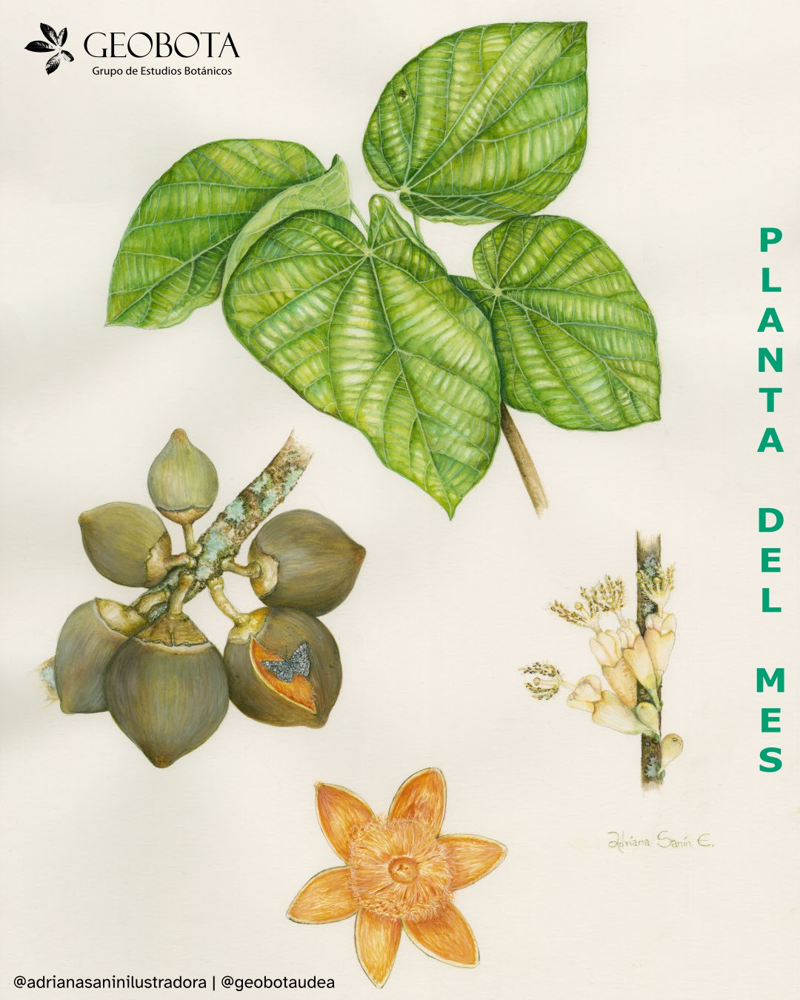

<meta name="fediverse:creator" content="@alexespinosaco@mstdn.social">

Para este mes traemos una especie muy apreciada en distintas regiones tropicales
de América: el sapote, también conocido como zapote, chupachupa o zapote
chupachupa. Su nombre científico, *Matisia cordata* Bonpl., tiene un significado
muy especial. El género *Matisia* honra al destacado ilustrador y artista de la
Real Expedición Botánica del Nuevo Reino de Granada, Francisco Javier Matis
Mahecha, a quien se le atribuyen al menos 326 láminas botánicas de
extraordinario detalle. Por otra parte, el epíteto *cordata* hace referencia a
la forma acorazonada de sus hojas.

{fig-align="center" group="my-gallery"
fig-alt="Ilustración botánica a color de Matisia cordata Bonpl., mostrando diferentes vistas de la planta. En el centro de la imagen se incluye el hábito. En la derecha un detalle de una hoja. En la izquierda una infrutescencia y un fruto partido. En la esquina superior izquierda aparece el logo del Grupo de Estudios Botánicos GEOBOTA. En el margen derecho dice «Planta del mes». En la parte inferior, se encuentran los créditos de la ilustración @adrianasaninilustradora y @geobotaudea."}

Esta especie pertenece a la familia Malvaceae y presenta una distribución
neotropical, desde Costa Rica hasta Bolivia y el noroccidente de Brasil. Habita
bosques secos y húmedos entre los 1000 y 1500 m s. n. m. y puede alcanzar hasta
14 metros de altura.

## Flores y frutos que nacen del tronco

Una de las características más llamativas de *Matisia cordata* es su floración y
fructificación cauliflora, es decir, flores y frutos que crecen directamente
sobre el tronco y las ramas principales. Debido a esto, sus flores suelen pasar
desapercibidas a primera vista.

Las flores son de tonos amarillo pálido a beige y son visitadas por diversos
polinizadores, incluyendo abejas, aves y murciélagos. Sus frutos globosos, de
color marrón, son ampliamente apreciados por su pulpa dulce y anaranjada. Cuando
maduran y caen al suelo, atraen fauna como monos, hormigas y mariposas.

Con base en especímenes depositados en el Herbario de la Universidad de
Antioquia, se ha registrado floración durante todo el año, mientras que la
fructificación ocurre principalmente entre mayo y diciembre. Además, se estima
que el desarrollo completo del fruto, desde el botón floral hasta la maduración,
tarda alrededor de 269 días.

## Usos y aprovechamientos

El sapote es una especie con múltiples usos ecológicos, alimenticios y
culturales. En sistemas agroforestales y agrícolas se utiliza como árbol de
sombra para cultivos como café y cacao, mientras que en restauración ecológica
se emplea para atraer fauna nectarívora y frugívora, favoreciendo la
recuperación de bosques.

Su fruto es ampliamente consumido en distintas regiones amazónicas y
neotropicales. La pulpa, rica en fibra y minerales como potasio, fósforo y
calcio, se utiliza en la preparación de jugos, compotas, mermeladas, helados y
vinos artesanales. Por su parte, las semillas poseen un alto contenido de grasas
y pueden consumirse tostadas.

En carpintería, su madera ligera ha sido empleada para fabricar cajones y otros
objetos livianos. A nivel ornamental, se recomienda su siembra en espacios
abiertos y cerca de cuerpos de agua urbanos debido a su atractivo porte y valor
ecológico.

## Importancia medicinal y estado de conservación

En algunas comunidades indígenas amazónicas se han registrado usos tradicionales
relacionados con procesos de gestación y posparto. Además, estudios recientes
sugieren que la pulpa posee compuestos antioxidantes asociados a carotenoides y
polifenoles.

En cuanto a su conservación, *Matisia cordata* está catalogada como de
Preocupación Menor (LC) según la UICN, debido a su amplia distribución
geográfica y a la relativa estabilidad de sus poblaciones.

Ilustración: [Adriana María Sanín
Escobar](https://www.instagram.com/adrianasaninilustradora/).
