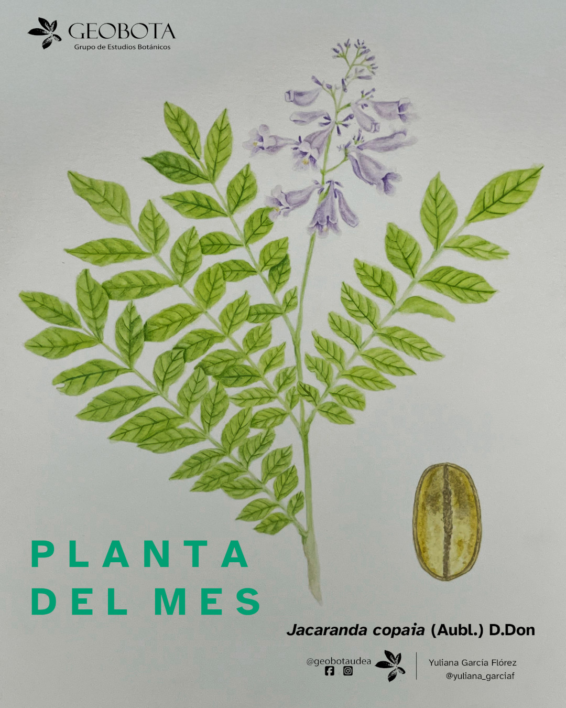

<meta name="fediverse:creator" content="@alexespinosaco@mstdn.social">

La **jacaranda**, conocida también como **canalete**, es un árbol perteneciente
a la familia **Bignoniaceae**, nativo de Centroamérica y Sudamérica. Es una
especie de rápido crecimiento que puede alcanzar hasta **35 metros de altura** y
se distribuye desde el nivel del mar hasta aproximadamente los **1600 m s. n.
m.**

{fig-align="center" group="my-gallery"
fig-alt="Ilustración botánica a color de Jacaranda copaia (Aubl.) D.Don, mostrando diferentes vistas de la planta. En el centro de la imagen se incluye el hábito. En la derecha un detalle de una semilla. En la esquina superior izquierda aparece el logo del Grupo de Estudios Botánicos GEOBOTA. En la esquina superior derecha dice «Planta del mes». En la parte inferior, se encuentran los créditos de la ilustración @adrianasaninilustradora y @geobotaudea."}

Su amplia distribución le permite habitar diferentes ecosistemas tropicales,
incluyendo bosques húmedos, muy húmedos y bosques premontanos. Una de sus
características más llamativas es su abundante floración: sus inflorescencias de
color lila atraen principalmente insectos polinizadores, convirtiéndola en una
especie importante dentro de las dinámicas ecológicas de los bosques donde
crece.

Sus frutos son cápsulas que contienen semillas aladas, una adaptación que
favorece su dispersión por el viento y facilita la colonización de nuevos
espacios. Esta característica, junto con su rápido crecimiento, hace que
*Jacaranda copaia* sea una especie de interés en procesos de **restauración
ecológica**, recuperación de áreas degradadas y rehabilitación de suelos.
Además, la caída de sus hojas contribuye al aporte de materia orgánica y
nutrientes al suelo.

## Usos tradicionales y aprovechamiento

La madera de *Jacaranda copaia* es ligera y fácil de trabajar, por lo que ha
sido utilizada tradicionalmente en construcciones internas, elaboración de
molduras para puertas y ventanas, mangos de herramientas y diferentes productos
artesanales. También se han registrado usos culturales asociados a la
elaboración de pequeños instrumentos musicales.

En algunas comunidades de la región amazónica se han reportado usos medicinales
tradicionales de sus hojas y corteza, principalmente en preparaciones
relacionadas con afecciones cutáneas, problemas gastrointestinales y otros
tratamientos locales. Investigaciones fitoquímicas han identificado compuestos
como **flavonoides, polifenoles e iridoides**, asociados a propiedades
antioxidantes, antiinflamatorias y antisépticas; sin embargo, se requieren más
estudios para establecer plenamente sus aplicaciones medicinales.

## Otros usos e importancia cultural

Aunque no existe un amplio registro de consumo directo de sus frutos u hojas,
sus semillas han sido utilizadas tradicionalmente como alimento en algunas
regiones, de manera similar a las almendras. Además, de ellas puede extraerse un
aceite empleado en preparaciones locales de Centroamérica.

Por su crecimiento rápido, valor ecológico y diversidad de usos, la jacaranda
representa una especie relevante para las comunidades humanas y para la
conservación de los ecosistemas tropicales.

Actualmente, *Jacaranda copaia* se encuentra categorizada como **Preocupación
Menor (LC)** según la Lista Roja de la UICN, debido a su amplia distribución y
presencia en diferentes regiones.

Ilustración: [Yuliana García
Flórez](https://www.instagram.com/yuliana_garciaf/).
